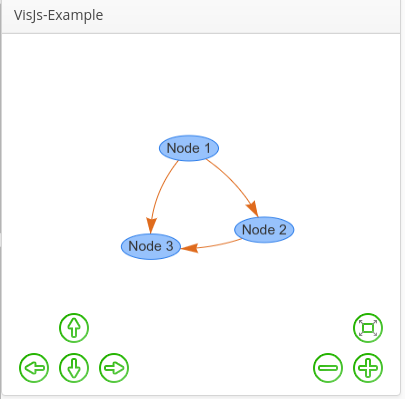

# visjs-example
## Introduction
Runs a simple Vaadin application with one visjs network diagramm. 

## Requirements

 - Requires visjs-addon 2.0.0.2-SNAPSHOT
 - Current visjs-addon can be found here  https://github.com/watho/visjs. It is based on the vaadin-addon of [sameeraroshan](https://github.com/sameeraroshan/visjs) extended by [trobar](https://github.com/trobar/visjs)

## Workflow

 - To compile the entire project, run "mvn install".
 - To run the application, run "mvn jetty:run" and open http://localhost:8080/ .
 - To produce a deployable production mode WAR:
   - change productionMode to true in the servlet class configuration (nested in the UI class)
   - run "mvn clean package"
   - test the war file with "mvn jetty:run-war"

## General Informations
 - See https://vaadin.com/framework for general information about Vaadin.
 - See http://visjs.org/network_examples.html for general information about visjs.